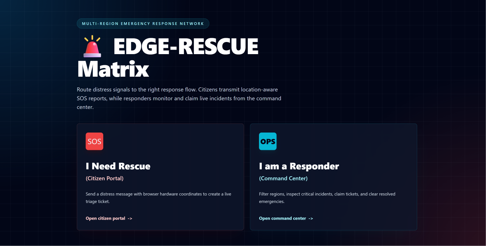
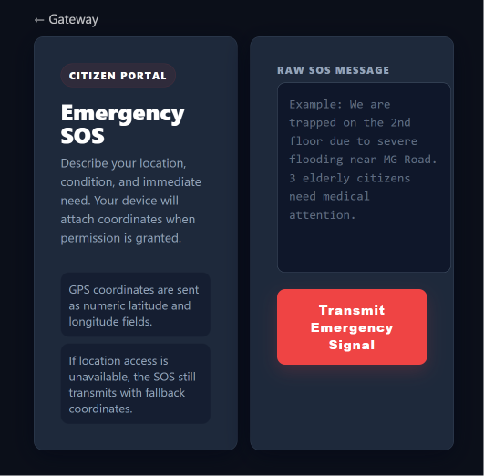
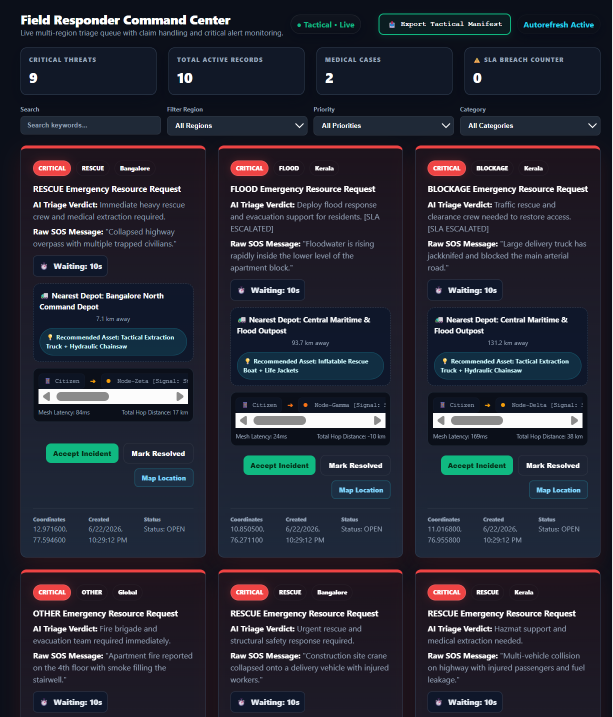
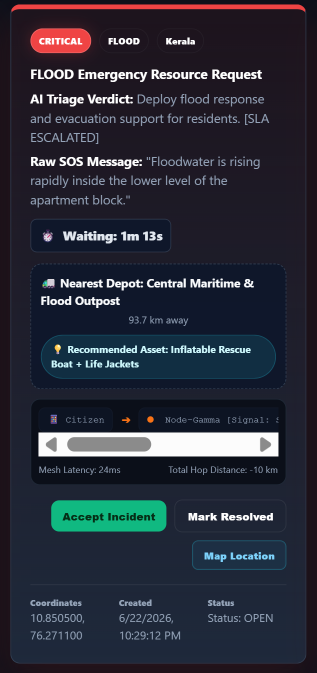

# 🚨 Edge-Rescue: Autonomous Local-First Crisis Dispatch Matrix

> An intelligent, local-first emergency response system designed to route distress signals, resolve dispatch conflicts, and maintain operational continuity during catastrophic network failures and complete communication blackouts.

---

## 🔗 Demo Links

| Page | Link |
| :--- | :--- |
| Live Render Demo | https://edge-rescue.onrender.com |
| Local Home Page | `http://localhost:8082/index.html` |
| Local Citizen SOS Page | `http://localhost:8082/citizen.html` |
| Local Command Dashboard | `http://localhost:8082/dashboard.html` |

---

## 🎯 Problem Statement

During floods, landslides, earthquakes, medical emergencies, or network blackouts, normal emergency apps can fail because they depend on internet, cloud servers, and stable communication towers.

Edge-Rescue solves this by running the emergency workflow on the local machine first. Citizens can send help signals, the system can read and sort emergency messages, and command teams can manage rescue tickets even when the internet is not available.

---

## ✅ How Edge-Rescue Solves It

* **No internet available**: The app can still run on the local machine.
* **Citizen still sends SOS**: A trapped person can send a message with location details.
* **Local system reads and classifies it**: The offline AI reads the message, creates a summary, sets the category, and marks the priority.
* **Command desk assigns rescue team**: Operators can filter, monitor, and claim incidents from the dashboard.
* **Data can be exported offline**: The active emergency list can be downloaded and copied to a USB drive.

---

## 👥 User Roles

| User | What They Can Do |
| :--- | :--- |
| Citizen | Send an emergency message and location coordinates. |
| Command Operator | View, filter, monitor, claim, and export emergency tickets. |
| Rescue Team | Accept an incident and respond to the assigned location. |

---

## 🔁 Application Flow

```text
Citizen SOS → Local Backend → AI Triage → Dashboard Queue → Rescue Team Claim → CSV Export
```

---

## 🖼️ Screenshots


### Home Page



### Citizen SOS Page



### Command Dashboard



### Ticket Details and Mesh Path



### CSV Export


---

## 🧪 Offline Testing Steps

Use this small judge-focused test script to prove the offline workflow:

1. **Start Ollama**:

   ```bash
   ollama run llama3.2:1b
   ```

2. **Start Spring Boot**:

   ```bash
   .\mvnw.cmd clean spring-boot:run
   ```

   You can also run:

   ```bash
   mvn spring-boot:run
   ```

3. **Turn off Wi-Fi** on your computer.
4. **Open the citizen page** at `http://localhost:8082/citizen.html`.
5. **Submit an SOS** with a disaster message and location coordinates.
6. **Open the dashboard** at `http://localhost:8082/dashboard.html`.
7. **Check the dashboard update** and confirm that the new ticket appears.
8. **Test the main controls**: region filters, category filters, warning clocks, worker claim lock, and CSV download.

---

## 🔌 API Endpoints

| Method | Endpoint | Purpose |
| :--- | :--- | :--- |
| POST | `/api/tickets/submit` | Create a new SOS ticket from the citizen page. |
| GET | `/api/tickets/live` | Fetch live emergency tickets for the dashboard. |
| GET | `/api/tickets/stats` | Fetch dashboard counts for active, critical, medium, low, medical, flood, and rescue tickets. |
| POST | `/api/tickets/{id}/claim?workerName=Name` | Claim a ticket and lock it to one rescue worker. |
| DELETE | `/api/tickets/{id}/resolve` | Resolve and remove a completed ticket. |


## 🌟 Core Architecture & Technical Highlights (✅ Feature List: What Users Can Do)

* **Send Offline Help Signals**: Citizens trapped in a disaster can type a message and send their exact location coordinates without any internet connection.
* **Smart AI Text Reading**: A built-in, local AI model instantly reads the frantic text message, writes a short summary, notes down what sector it belongs to (like FLOOD or MEDICAL), and assigns a threat priority (CRITICAL, MEDIUM, or LOW).
* **Multi-Region Dashboard Filtering**: Command desk operators can instantly filter all incoming emergencies by region (like Bangalore or Kerala) or category to manage help requests smoothly.
* **Live Emergency Warning Clocks**: The system tracks the exact time an incident sits unhandled. If a ticket stays open for more than 3 minutes, it flashes red on the screen to grab the operator's attention immediately.
* **Closest Supply Base Finder**: The application automatically computes the exact physical distance (in kilometers) from the citizen's location to the nearest supply center and automatically recommends the right vehicle asset to send (like boats or ambulances).
* **Mesh Network Path Visualizer**: Every ticket shows a graphic map of the exact device-to-device "mesh hops" the message traveled through to reach the station, keeping track of signal strength and timing delays.
* **Rescue Team Worker Lock**: When a rescue worker types in their name and clicks "Accept Incident", the ticket locks instantly so two different field teams do not accidentally run to the exact same spot.
* **One-Click Local File Downloader**: Command centers can download the entire active list of emergencies into a clean spreadsheet file with one click, letting teams copy data onto a USB drive and hit the field completely offline.
* **Pre-Loaded Emergency Test Data**: The system starts with 10 realistic disaster records, so users can immediately test filters, timers, distance counters, search, and claim buttons without typing sample data first.
* **Single-Page Command Dashboard**: The dashboard updates tickets, filters, and timers without reloading the browser, making it faster and smoother during emergency operations.

---
## 🚀 Future Scope

* **Real LoRa mesh device integration**: Connect the software to physical LoRa devices for long-range offline emergency communication.
* **SMS gateway fallback**: Allow SOS messages to enter the system through SMS when mobile data is not available.
* **Offline map tiles**: Add local map files so operators can view locations even without online maps.
* **Role-based login**: Add separate access for citizens, command operators, rescue workers, and admins.
* **Android PWA support**: Make the citizen page installable on Android phones as a lightweight offline-ready app.
* **Multi-command-center sync when internet returns**: Sync local emergency records between different command centers after the network comes back.

---
## 🌐 IMPORTANT NOTE (Cloud vs. Local Offline)

> ⚠️ Read Before Testing: This app is engineered as a Hybrid Resilience Matrix.
>
> 1. On the Live Render Link (Online): Because this is hosted on a Render Free-Tier account, it needs an internet connection. Free cloud servers do not have the power (VRAM) to run real AI models locally, so the live website link automatically switches to a fast Keyword Rules fallback engine so the server does not freeze.
> 2. On Your Local Machine (100% Offline): This is where the true core innovation happens! When you disconnect your computer's Wi-Fi entirely and run it locally, the backend connects natively to your machine's CPU/GPU to run true semantic AI triage using Ollama.

---

## 🛠️ The Technology Stack

| Layer | Component | Simple Description |
| :--- | :--- | :--- |
| Backend Core | Java 17 / Spring Boot 3.x | Handles the local server, REST API endpoints, routing logic, and system configurations. |
| Database Matrix | H2 Database Engine | Set to In-Memory (mem) mode to isolate data inside the system RAM, bypassing hard drive write-locks or disk lags during an absolute blackout. |
| AI Triage Engine | Ollama (Llama 3.2: 1B) | Fully offline artificial intelligence pipeline that creates summaries, categories, and priority ratings directly on-device. |
| Frontend UI Layout | Vanilla HTML5 / CSS3 / JS | A premium, clean single-page dashboard designed to look like Tailwind CSS with absolutely zero external CDN or internet dependencies. |
| Automation Daemons | Java @Scheduled Threads | Background workers that update the live timers, track durations, and calculate distances automatically. |

---

## 📂 System Project Structure

```text
Edge-Rescue/
├── src/main/java/com/edgeRescue/demo/
│   ├── config/          # DatabaseSeeder.java (Autoloads 10 mock data rows)
│   ├── controller/      # API Routes & Request Handlers
│   ├── model/           # Emergency Ticket SQL Data Objects
│   ├── repository/      # Spring Data JPA H2 Memory Access Layer
│   ├── service/         # Ollama Local AI Integrations & SLA Workers
│   └── DemoApplication.java
└── src/main/resources/
    ├── application.properties  # Configured for localhost loopback 127.0.0.1
    └── static/          # 100% Self-Contained Frontend User Interfaces
        ├── index.html       # Main Hub Entry Gateway Module
        ├── citizen.html     # SOS Emergency Transmission Interface
        └── dashboard.html   # Command Desk Single-Page Matrix
```

---

## 💾 Pre-Loaded Tactical Dataset (Auto-Seeder)

To ensure the application looks like a busy, realistic emergency operations center the moment you open it, an automatic Database Seeding Engine is integrated into the backend. If the database is completely empty on startup, it instantly injects 10 distinct, high-fidelity mock disaster records (Floods, Medical Trauma, Landslides, and Blockages) spread across Bangalore, Kerala, and Global sectors. This allows judges to test the filtering menus, search bars, live tickers, distance counters, and claim buttons immediately without manual typing.

---

## 💻 Execution & Quickstart Guide

**Prerequisites**: Ollama App installed on your computer. Java 17 (or higher) and Maven installed.

### Step 1: Run the AI Model Locally

Run this in your terminal:

```bash
ollama run llama3.2:1b
```

### Step 2: Update System Configurations

Make sure `application.properties` contains:

```properties
server.port=8082
spring.ai.ollama.base-url=http://127.0.0.1:11434
spring.ai.ollama.chat.options.model=llama3.2:1b
spring.datasource.url=jdbc:h2:mem:edgerescuedb;DB_CLOSE_DELAY=-1;DB_CLOSE_ON_EXIT=FALSE
```

### Step 3: Run the Application Completely Offline

Turn your computer's Wi-Fi completely off. Navigate to the root directory and execute the wrapper boot sequence.

On Windows:

```bash
.\mvnw.cmd clean spring-boot:run
```

or:

```bash
mvn spring-boot:run
```

On macOS/Linux:

```bash
./mvnw clean spring-boot:run
```

Open your browser at `http://localhost:8082/index.html`

---

## 📌 Additional Data Points to Share

* **Why it uses a Single-Page Application (SPA)**: In a real disaster, computer memory and battery life are extremely valuable. The dashboard works as a single-page application so filters, ticket clicks, and live timers update without reloading the browser tab. This keeps the app fast, smooth, and ready during long emergency use.
* **Pre-Loaded Startup Dataset**: The app includes a smart data-seeding engine. On startup, it automatically loads 10 highly realistic, high-fidelity mock disaster cases. This ensures the dashboard maps, filters, and trackers work beautifully the moment you open it without having to type test data.
* **RAM Database Speed**: The database runs completely inside the system RAM (In-Memory Mode). This prevents the software from freezing up due to computer hard-drive file locks or permission issues during blackouts.
* **Hybrid Cloud Review Mode**: Because this app is hosted online using a Render Free-Tier account, it switches to a fast Keyword Rules parsing fallback to save server memory. To experience the true core innovation, run it locally with Ollama and the Llama 3.2 1B model.
